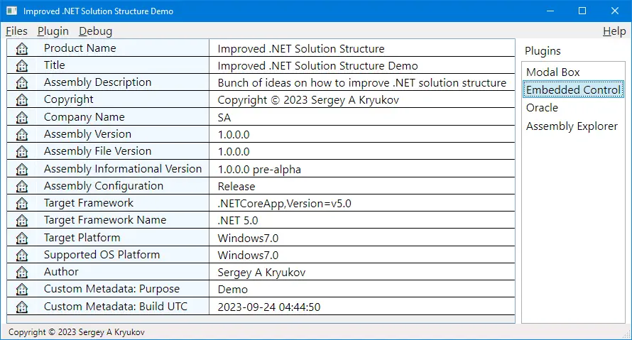

# Improved .NET Solution Structure

This project is a set of units and illustrative materials used to share several ideas on the improvement of the .NET solution structure. 
Compatible with .NET v.&thinsp;5 and later, partially applicable to .NET Framework.

### Original publications:

[XAML Data to Code](https://www.codeproject.com/Articles/5368892/XAML-Data-to-Code)

Covered topics:

* Source code isolation based on shared MSBuild properties
* Batch build and clean-up
* Cascading MSBuild properties
* Centralized or cascading framework targeting
* Centralized or cascading versioning
* Injection of custom MSBuild properties into the code to provide common attributes for all or selected projects
* Dependency layers
* Plugin architecture

WPF-specific topics:

* `AdvancedApplication` class used to expose standard and custom MSBuild properties
* Explicit `Main`
* Centralized adaptive exception handling
* Centralized and cascading styling and resource dictionaries 
* XAML-based localization with satellite assemblies
* XAML to code: custom markup for arbitrary data resources
* XAML to code: code generation

## Under development

