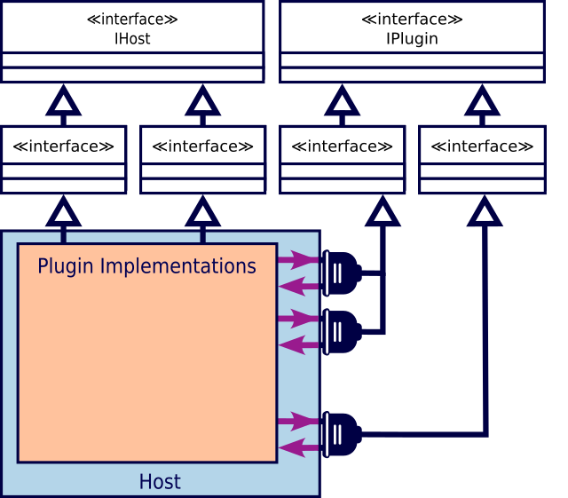

@numbering {
    enable: false
}

{title}Improving .NET Solution Structure: Code Isolation

[*Sergey A Kryukov*](https://www.SAKryukov.org)

Good news: your development life can be more pleasant and less troublesome than you thought

This article presents a set of units and illustrative materials used to share several ideas on the improvement of a .NET solution structure. As a part of a projected series of articles on the topic and corresponding code repository, it covers code isolation in general, and in specific isolation aspects: isolation of source code, solution metadata, versions, dependency layers, metadata-driven technologies, and plugin architecture.

<!-- https://www.codeproject.com/Articles/5367811/Solution-Structure-Code-Isolation -->

<!-- <h2>Contents</h2> is not Markdown element, just to avoid adding it to TOC -->
<!-- change style in next line <ul> to <ul style="list-style-type: none"> -->
<!--
For CodeProject, makes sure there are no HTML comments in the area to past!


--> 
---
<!-- copy to CodeProject from here
αβγδΔπ
------------------------------------------->

{id=image-title}


<blockquote id="epigraph" class="FQ"><div class="FQA">Epigraph:</div>
<dt><i>Everything should be made as simple as possible, but no simpler</i></dt>
<dd>Albert Einstein</dd>
</blockquote>

## Contents{no-toc}

@toc

## Introduction

Albert Einstein made it quite clear about "as simple as possible", and the present article elaborates on "but no simpler". Moreover, it should make it clear that "too simple" in effect means "overcomplicated".

When we create a new .NET solution in a default way, and then add at least two projects in a default way, it is already too simple. And already creates a badly overcomplicated solution. Sounds weird to you? Then you really need to read more about it.

## Code Isolation

### Why Default Solution is Bad?

SA???

### Isolation of Source Code

SA???

```{lang=XML}{id=code-directory-build-props}
&lt;Project&gt;
    &lt;Import Project="$(SolutionDir)/Metadata.props"/&gt;
 
&lt;PropertyGroup&gt; &lt;!-- customize:  --&gt;
  &lt;TargetFramework&gt;net7.0&lt;/TargetFramework&gt;
&lt;/PropertyGroup&gt;

&lt;PropertyGroup&gt; &lt;!-- change value, don't change property name: --&gt;
  &lt;_intermediateOutputPathRoot&gt;.intermediate&lt;/_intermediateOutputPathRoot&gt;
&lt;/PropertyGroup&gt;

&lt;PropertyGroup Condition="'$(Configuration)'=='Release'"&gt;
  &lt;DebugType&gt;none&lt;/DebugType&gt;
  &lt;DebugSymbols&gt;false&lt;/DebugSymbols&gt;
&lt;/PropertyGroup&gt;

&lt;PropertyGroup&gt;

  &lt;BaseIntermediateOutputPath&gt;$([System.IO.Path]::Combine(
      $(SolutionDir),
      $(_intermediateOutputPathRoot),
      $(MSBuildProjectName),
      $(Configuration).$(Platform)))&lt;/BaseIntermediateOutputPath&gt;
  &lt;OutputPath&gt;$([System.IO.Path]::Combine(
      $(SolutionDir),
      output.$(Configuration).$(Platform)))&lt;/OutputPath&gt;
  &lt;AppendTargetFrameworkToOutputPath&gt;false&lt;/AppendTargetFrameworkToOutputPath&gt;
  &lt;ProduceReferenceAssembly&gt;false&lt;/ProduceReferenceAssembly&gt;

  &lt;TreatWarningsAsErrors&gt;true&lt;/TreatWarningsAsErrors&gt;
  &lt;!-- Placeholders: --&gt;
  &lt;WarningsAsErrors&gt;&lt;/WarningsAsErrors&gt;
  &lt;WarningsNotAsErrors&gt;&lt;/WarningsNotAsErrors&gt;

  &lt;AssemblyVersion&gt;$(CustomUnifiedVersion)&lt;/AssemblyVersion&gt;
  &lt;FileVersion&gt;$(CustomUnifiedVersion)&lt;/FileVersion&gt;
  &lt;InformationalVersion&gt;$(CustomUnifiedVersion) $(...))&lt;/InformationalVersion&gt;

&lt;/PropertyGroup&gt;

&lt;/Project&gt;
```

SA???

### Hierarchy of Project Properies

SA???

### Isolation of Product Metadata

Please see the file SA???

"Metadata.props":

```{lang=XML}{id=code-metadata-props}
&lt;Project&gt;
 
  &lt;PropertyGroup&gt; &lt;!-- customize:  --&gt;
    &lt;CustomUnifiedVersion&gt;1.2.3.*&lt;/CustomUnifiedVersion&gt;
    &lt;!-- can be alpha, beta, RC1, RC2, etc.: --&gt;
    &lt;CustomInformationalVersionSuffix&gt;&lt;/CustomInformationalVersionSuffix&gt;
    &lt;Copyright&gt;Copyright © ...&lt;/Copyright&gt;
    &lt;Product&gt;Your product name&lt;/Product&gt;
    &lt;Description&gt;Your product name&lt;/Description&gt;
    &lt;Company&gt;CompanyName&lt;/Company&gt;
    &lt;AssemblyTitle&gt;$(Product) Demo (for example)&lt;/AssemblyTitle&gt;
  &lt;/PropertyGroup&gt;

  &lt;ItemGroup&gt; &lt;!-- optional custom attributes, can be multiple: --&gt;
    &lt;!-- for example: ---&gt;
    &lt;!-- custom SA.Agnostic.AuthorAttribute: --&gt;
    &lt;Authors Include="..."/&gt;
    &lt;AssemblyMetadata Include="Custom Metadata: Purpose" Value="Demo"/&gt;
    &lt;AssemblyMetadata
        Include="Custom Metadata: Build UTC"
        Value="$([System.DateTime]::UtcNow.ToString(yyyy-MM-dd HH:mm:ss))"/&gt;
  &lt;/ItemGroup&gt;
&lt;/Project&gt;
```

Now, [we can look at the results](#image-demo-structure-application), but let's first discuss versions in detail.
The elements `<CustomUnifiedVersion>` and `<CustomInformationalVersionSuffix>` are not predefined MSBuild properties. The file "Metadata.props" is imported by the file "Directory.Build.targets" where these two properties are used for all projects. Let's see how they are used and why.

### Unified Versioning

Did you know how many assembly attributes related to `Version` .NET suggests? At the moment of writing, [there are three](https://learn.microsoft.com/en-us/dotnet/api/system.reflection?view=net-7.0): `AssemblyVersionAttribute`, `AssemblyFileVersionAttribute`, and `AssemblyInformationalVersionAttribute`. The first two present the data of the type `System.Version`, but the property of `<AssemblyInformationalVersion>` is string.

Why so many? I would say, the major reason is the obsession of Microsoft people with over-comlicating things. But there are exact reason why you should use all three of them. Historically, `AssemblyFileVersionAttribute` is the part of Windows executable file resources introduced well before [.NET](https://en.wikipedia.org/wiki/.NET) and before [.NET Framework](https://en.wikipedia.org/wiki/.NET_Framework). When you view an executable file properties using standard Windows Shell API, for example, via a file manager, you can see no version information, or you can see "File version" without "Product version". Properties don't shows "informationan version" though, but this is a string where the developers may need to write the those informal release characteristics of the current version, such as "alpha", "beta", "RC1", "RC2" (Release Candidate), and the like.

Do you want to enter all three version items separately? Hardly. I would suggest they should be based on the same version. Do you want to enter this information separately for every project? I don't think so, but sometime you may need more than one version per solution. Even in this case, you don't need to enter individual property information for each project.

Instead, you can define only two items related to version information: one is the basic version, and another one is the optional string suffix like "alpha" or "beta". If you define it just once, this information will go to all the projects, as it is [shown above in the file "Metadata.props"](#code-metadata-props).

In wost case, when you have more then one version in a solution, you can group the projects and define different version information in a [separate ".props file" in a directory of such a group](#heading-hierarchy-of-project-properies).

{id=image-demo-structure-application}In addition to viewing of the file properties, we can collect all the metadata in some application and present it all:


Usually, this kind of information is shown in an About window, or something like that.

Is is all? Not yet. Look at the the table heading "Author" shown in this picture. This is a tricky item. Changes are, you don't need it, but let's discuss it anyway, just for fun.

### Advanced: Custom Attrubute Injection

No, this is not something I would recommend to do. This is just the demonstration of the flexibility of MSBuild system. Better consider it as a marginal and exotic feature, not to implement it, but just keeping in mind that such things are possible and even pretty easy to do.

Here is the story:

When I prepared the software for the present article, I found that my "Directory.Build.targets" file defines the value for the property "Author", and the value was empty. I did not remember where it came from — I copied the file from one solution to another. I tried to find the ends and found that it does not go anywhere, and I could not find a corresponding attribute in .NET. Probably, some publication misled me, and I blindfoldedly added this attribute and later carried it across different projects and companies, without any use of it.

I decided that it is a good reason to develop and demonstrate some MSBuild techniques.

First, let's add the attribute `Author` to one of the assemblies on the lowest layer:

```{lang=C#}
[AttributeUsage(
    AttributeTargets.Assembly,
    AllowMultiple = true,
    Inherited = false)]
public class AuthorAttribute : Attribute {
    public AuthorAttribute(string author) { this.author = author; }
    readonly string author;
    public string Author { get { return author; } }
}
```

My first idea was to introduce two attributes, "Author" and "Authors", with a string array property, but immediately realized, that it would be much better to create only `AuthorAttribute`, but allow it to be multiple. Then the application could collect all the attributes of this type applied to an assembly and then present this information in different ways, depending on how many authors are found, zero, one or more. In my sample code the class `AssemblyWrapper` just re-works these attribute into a string array:

```{lang=C#}
public class AssemblyWrapper : System.Reflection.Assembly {
    
    public string[] Authors { // custom
        get {
            if (authors == null) {
                Attribute[] attributes = Attribute.GetCustomAttributes(
                    assembly,
                    typeof(AuthorAttribute));
                if (attributes == null || attributes.Length < 1) return null;
                authors = new string[attributes.Length];
                for (int index = 0; index < attributes.Length; ++index)
                    authors[index] =
                        ((AuthorAttribute)attributes[index]).Author;
            } //if
            return authors;
        } //get Authors
    } //Authors

    //...
    string[] authors;

}
```

But now, where to put the code where this attrubute is applied to an assemby? It needs just some code file with one or more lines like this:

```{lang=C#}
[assembly:Agnostic.Author("some name goes here")]
```

Adding such a file to each project... Or even adding a single code file and referencing it from each project... no, it would be so dumb lame that it be much data not to get in all this activity at all. We can do better. Let's add a "targets" file in the root of the solution and generate the code file with appropriate content, and add it in compilation for all the assembly projects of the solution:

Directory.Build.targets:

```{lang=XML}
&lt;Project&gt;

  &lt;!-- ...  --&gt;

  &lt;ItemGroup&gt;
      &lt;Compile Include="$(_temporaryFilePathName)" Visible="false"/&gt;
  &lt;/ItemGroup&gt;

  &lt;Target
    Name="InjectCustomAssemblyAttributes"
    BeforeTargets="BeforeBuild;BeforeRebuild"&gt;
    &lt;WriteLinesToFile
       File="$(_temporaryFilePathName)"
       Lines="@(Authors -&gt; '[assembly:SA.Agnostic.Author(%22...%22)]')"
       Encoding="Unicode"
       Overwrite="true"
       WriteOnlyWhenDifferent="true"/&gt; 
  &lt;/Target&gt;

&lt;/Project&gt;
```

In this file, all the authors come in the one or more items referenced in the argument `Lines`. In this simple example, there is only one author, not shown above, but the names come from the MSBuild property defined in "Metadata.props". For simplicity, the reference to this property is not shown above, but is shown as "%22...%22" (%22 is a quotation mark), so please see the files in the code sample provided in the solution. For several authors, we would need several lines, defined not as a property element under some property `<PropertyGroup>`, but using several items under some `<ItemGroup>` element. For the detailed explanation, please see Microsoft documentation on MSBuild [properties](https://learn.microsoft.com/en-us/visualstudio/msbuild/msbuild-properties) and [items](https://learn.microsoft.com/en-us/visualstudio/msbuild/msbuild-items).

In this `<Target>` element, all the attributes are important. The attribute `BeforeTargets` is important to even execute the target tasks with the build or rebuild. It is also important that the intermediate source file is created before the compilation starts. All the attributes of the [Task](https://learn.microsoft.com/en-us/visualstudio/msbuild/msbuild-task) named `<WriteLinesToFile>` are also important. The location of the generated file in chosen to have only one file in the solution. `Encoding` is important because the authors can belong to different cultures. The attribute `Overwrite` and `WriteOnlyWhenDifferent` are important to keep the identity during incremental build --- the set of authors can be modified during build --- but the file should be written only once per build.

Now we can see the final result of such a build [in the main window of the application "Demo.Structure"](#image-demo-structure-application).

## Dependency Layers


SA???

## Plugin Architecture

In the general case, all plugin systems are pretty interesting: there is always a host system and a set of plugins, and their dependencies are reciprocal: the host provides access to a certaint context for the plugins to operate, and the plugins provide the interface to their implementation to the host.

For example, if a type of plugin is supposed to generate some data items, the host may need to provide each plugin instance with some container object where this data should be placed. And anything elase like that. These reciprocal dependencies are figuratively depicted  as colored arrows in the picture shown below:



These diagram, despite of its playful character, still observes some of the rules of the UML diagram. In particular, it shows interfaces, inheritance and directed associations. The interfaces are required to provide that reciprocal dependencies between implementations of the host and the plugins, and stay away from referencing the implementations themselves. It is generally very important, and it is critically important for plugin architecures, where the host cannot access any plugin implementation detail in principle, because at the moment of the build plugin implementations are absolutely unknown to the system.

Before considering further details of the architecture, let's discuss how it looks in the aspect of the dependency layer.

### Plugin Architecture in Dependency Layers

At this moment, it should become clear that the schema of the dependency layers I suggested [above](#heading-dependency-layers) is not so arbitrary. Let's do some reasoning on dependencies. 

* Both the host and plugins need to reference some host interfaces and some plugin interfaces. Therefore, the base plugin interfaces and base host interfaces needs to be implemented 

### Plugin Interfaces

In .NET, interfaces presents a weak form of multiple inheritance, so the host and plugins may implement more than one interface. The host operate

SA???

### Host Interfaces

SA???

### Accessing Plugin Implementations

SA???

### Plugin Loading

SA???

### Sentiments on Unloading

SA???

## Compatibility and Testing

The solution requires .NET version 5 or later. The build is based on .NET and batch build, it does not require Visual Studio or any other IDE.

Tested on .NET 5 and 7.

To change a target framework, edit the file "Directory.Build.props", and modify the property `<TargetFramework>`. It will change target frameworks in all projects automatically, including those requiring "-windows".

## What's Next?

In a next article, I plan to discuss UI-specific aspects and, in particular, WPF.

First and foremost, we need to discuss XAML-based localization with satellite assemblies. This is a feature already implemented in the demo solution. Please see the [GitHub repository dotnet-solution-structure](https://github.com/SAKryukov/dotnet-solution-structure).

Keep in touch!

## Conclustions

The [title image on top of the present article](#image-title) symbolizes, with the help of the Yin and Yang conception, two important things:

* The relationships between things are not hierarchical, because the mythical simplicity of the hierarchical tree structure in real life is disrupted by the ubiquity of reciprocal relations.
* We still can cope with this complexity with strictly layered dependency organization.
