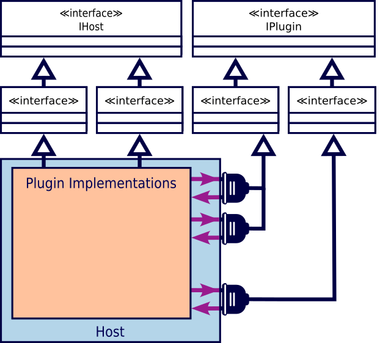

@numbering {
    enable: false
}

{title}Improving .NET Solution Structure: Code Isolation

[*Sergey A Kryukov*](https://www.SAKryukov.org)

Good news: your development life can be more pleasant and less troublesome than you thought

This article presents a set of units and illustrative materials used to share several ideas on the improvement of a .NET solution structure. As a part of a projected series of articles on the topic and corresponding code repository, it covers code isolation in general, and in specific isolation aspects: isolation of source code, solution metadata, versions, dependency layers, metadata-driven technologies, and plugin architecture.

<!-- https://www.codeproject.com/Articles/5367811/Solution-Structure-Code-Isolation -->

<!-- <h2>Contents</h2> is not Markdown element, just to avoid adding it to TOC -->
<!-- change style in next line <ul> to <ul style="list-style-type: none"> -->
<!--
For CodeProject, makes sure there are no HTML comments in the area to past!


--> 
---
<!-- copy to CodeProject from here
------------------------------------------->

{id=image-title}


<blockquote id="epigraph" class="FQ"><div class="FQA">Epigraph:</div>
<dt><i>Everything should be made as simple as possible, but no simpler</i></dt>
<dd>Albert Einstein</dd>
</blockquote>

## Contents{no-toc}

@toc

## Introduction

Albert Einstein made it quite clear about "as simple as possible", and the present article elaborates on "but no simpler". Moreover, it should make it clear that "too simple" in effect means "overcomplicated".

When we create a new .NET solution in a default way, and then add at least two projects in a default way, it is already too simple. And already creates a badly overcomplicated solution. Sounds weird to you? Then you really need to read more about it.

## Code Isolation

SA???

### Why Default Solution is Bad?

SA???

### Isolation of Source Code

SA???

"Directory.Build.props":

```{lang=XML}{id=code-directory-build-props}
&lt;Project&gt;
    &lt;Import Project="$(SolutionDir)/Metadata.props"/&gt;
 
  &lt;PropertyGroup&gt; &lt;!-- customize:  --&gt;
    &lt;TargetFramework&gt;net7.0&lt;/TargetFramework&gt;
  &lt;/PropertyGroup&gt;

  &lt;PropertyGroup&gt; &lt;!-- change value, don't change property name: --&gt;
    &lt;_intermediateOutputPathRoot&gt;.intermediate&lt;/_intermediateOutputPathRoot&gt;
  &lt;/PropertyGroup&gt;

  &lt;PropertyGroup Condition="'$(Configuration)'=='Release'"&gt;
    &lt;DebugType&gt;none&lt;/DebugType&gt;
    &lt;DebugSymbols&gt;false&lt;/DebugSymbols&gt;
  &lt;/PropertyGroup&gt;

  &lt;PropertyGroup&gt;

    &lt;BaseIntermediateOutputPath&gt;$([System.IO.Path]::Combine(
        $(SolutionDir),
        $(_intermediateOutputPathRoot),
        $(MSBuildProjectName),
        $(Configuration).$(Platform)))&lt;/BaseIntermediateOutputPath&gt;
    &lt;OutputPath&gt;$([System.IO.Path]::Combine(
        $(SolutionDir),
        output.$(Configuration).$(Platform)))&lt;/OutputPath&gt;
    &lt;AppendTargetFrameworkToOutputPath&gt;false&lt;/AppendTargetFrameworkToOutputPath&gt;
    &lt;ProduceReferenceAssembly&gt;false&lt;/ProduceReferenceAssembly&gt;

    &lt;TreatWarningsAsErrors&gt;true&lt;/TreatWarningsAsErrors&gt;
    &lt;!-- Placeholders: --&gt;
    &lt;WarningsAsErrors&gt;&lt;/WarningsAsErrors&gt;
    &lt;WarningsNotAsErrors&gt;&lt;/WarningsNotAsErrors&gt;

    &lt;AssemblyVersion&gt;$(CustomUnifiedVersion)&lt;/AssemblyVersion&gt;
    &lt;FileVersion&gt;$(CustomUnifiedVersion)&lt;/FileVersion&gt;
    &lt;InformationalVersion&gt;$(CustomUnifiedVersion) $(...))&lt;/InformationalVersion&gt;

  &lt;/PropertyGroup&gt;

&lt;/Project&gt;
```

SA???

### Hierarchy of Project Properties

SA???

### Isolation of Product Metadata

Please see the file SA???

"Metadata.props":

```{lang=XML}{id=code-metadata-props}
&lt;Project&gt;
 
  &lt;PropertyGroup&gt; &lt;!-- customize:  --&gt;
    &lt;CustomUnifiedVersion&gt;1.2.3.*&lt;/CustomUnifiedVersion&gt;
    &lt;!-- can be alpha, beta, RC1, RC2, etc.: --&gt;
    &lt;CustomInformationalVersionSuffix&gt;&lt;/CustomInformationalVersionSuffix&gt;
    &lt;Copyright&gt;Copyright © ...&lt;/Copyright&gt;
    &lt;Product&gt;Your product name&lt;/Product&gt;
    &lt;Description&gt;Your product name&lt;/Description&gt;
    &lt;Company&gt;CompanyName&lt;/Company&gt;
    &lt;AssemblyTitle&gt;$(Product) Demo (for example)&lt;/AssemblyTitle&gt;!
  &lt;/PropertyGroup&gt;

  &lt;ItemGroup&gt; &lt;!-- optional custom attributes, can be multiple: --&gt;
    &lt;!-- for example: ---&gt;
    &lt;!-- custom SA.Agnostic.AuthorAttribute: --&gt;
    &lt;Authors Include="..."/&gt;
    &lt;AssemblyMetadata Include="Custom Metadata: Purpose" Value="Demo"/&gt;
    &lt;AssemblyMetadata
        Include="Custom Metadata: Build UTC"
        Value="$([System.DateTime]::UtcNow.ToString(yyyy-MM-dd HH:mm:ss))"/&gt;
  &lt;/ItemGroup&gt;
&lt;/Project&gt;
```

Now, [we can look at the results](#image-demo-structure-application), but let's first discuss versions in detail.
The elements `<CustomUnifiedVersion>` and `<CustomInformationalVersionSuffix>` are not predefined MSBuild properties. The file "Metadata.props" is imported by the file "Directory.Build.targets" where these two properties are used for all projects. Let's see how they are used and why.

### Unified Versioning

Did you know how many assembly attributes related to `Version` .NET suggests? At the moment of writing, [there are three](https://learn.microsoft.com/en-us/dotnet/api/system.reflection?view=net-7.0): `AssemblyVersionAttribute`, `AssemblyFileVersionAttribute`, and `AssemblyInformationalVersionAttribute`. The first two present the data of the type `System.Version`, but the property of `<AssemblyInformationalVersion>` is a string.

Why so many? I would say, the major reason is the obsession of Microsoft people with overcomplicating things. But there are exact reasons why you should use all three of them. Historically, `AssemblyFileVersionAttribute` is the part of Windows executable file resources introduced well before [.NET](https://en.wikipedia.org/wiki/.NET) and before [.NET Framework](https://en.wikipedia.org/wiki/.NET_Framework). When you view properties of an executable file using standard Windows Shell API, for example, via a file manager, you can see no version information, or you can see "File version" without "Product version". Properties don't show "informational version" though, but this is a string where the developers may need to write all those informal release characteristics of the current version, such as "alpha", "beta", "RC1", "RC2" (Release Candidate), and the like.

Do you want to enter all three version items separately? Hardly. I would suggest they should be based on the same version. Do you want to enter this information separately for every project? I don't think so, but sometimes you may need more than one version per solution. Even in this case, you don't need to enter individual property information for each project.

Instead, you can define only two items related to version information: one is the basic version, and another one is the optional string suffix like "alpha" or "beta". If you define it just once, this information will go to all the projects, as it is [shown above in the file "Metadata.props"](#code-metadata-props).

In the worst case, when you have more than one version in a solution, you can group the projects and define different version information in a [separate ".props file" in a directory of such a group](#heading-hierarchy-of-project-properies).

{id=image-demo-structure-application}In addition to viewing the file properties, we can collect all the metadata in some application and present it all:


Usually, this kind of information is shown in an About window, or something like that.

Is is all? Not yet. Look at the table heading "Author" shown in this picture. This is a tricky item. Changes are, you don't need it, but let's discuss it anyway, just for fun.

### Advanced: Custom Attribute Injection

No, this is not something I would recommend doing. This is just a demonstration of the flexibility of the MSBuild system. Better consider it as a marginal and exotic feature, not to implement it, but just keeping in mind that such things are possible and even pretty easy to do.

Here is the story:

When I prepared the software for the present article, I found that my "Directory.Build.targets" file defines the value for the property "Author", and the value was empty. I did not remember where it came from — I copied the file from one solution to another. I tried to find the ends and found that it does not go anywhere, and I could not find a corresponding attribute in .NET. Probably, some publication misled me, and I blindfoldedly added this attribute and later carried it across different projects and companies, without any use of it.

I decided that it is a good reason to develop and demonstrate some MSBuild techniques.

First, let's add the attribute `Author` to one of the assemblies on the lowest layer:

```{lang=C#}
[AttributeUsage(
    AttributeTargets.Assembly,
    AllowMultiple = true,
    Inherited = false)]
public class AuthorAttribute : Attribute {
    public AuthorAttribute(string author) { this.author = author; }
    readonly string author;
    public string Author { get { return author; } }
}
```

My first idea was to introduce two attributes, "Author" and "Authors", with a string array property, but immediately realized, that it would be much better to create only `AuthorAttribute`, but allow it to be multiple. Then the application could collect all the attributes of this type applied to an assembly and then present this information in different ways, depending on how many authors are found, zero, one, or more. In my sample code, the class `AssemblyWrapper` just re-works these attributes into a string array:

```{lang=C#}
public class AssemblyWrapper : System.Reflection.Assembly {
    
    public string[] Authors { // custom
        get {
            if (authors == null) {
                Attribute[] attributes = Attribute.GetCustomAttributes(
                    assembly,
                    typeof(AuthorAttribute));
                if (attributes == null || attributes.Length &lt; 1) return null;
                authors = new string[attributes.Length];
                for (int index = 0; index &lt; attributes.Length; ++index)
                    authors[index] =
                        ((AuthorAttribute)attributes[index]).Author;
            } //if
            return authors;
        } //get Authors
    } //Authors

    //...
    string[] authors;

}
```

But now, where to put the code where this attribute is applied to an assembly? It needs just some code file with one or more lines like this:

```{lang=C#}
[assembly:Agnostic.Author("some name goes here")]
```

Adding such a file to each project... Or even adding a single code file and referencing it from each project... no, it would be so lame that it be much data not to get in all this activity at all. We can do better. Let's add a "targets" file in the root of the solution, generate the code file with appropriate content, and add it in compilation for all the assembly projects of the solution:

"Directory.Build.targets":

```{lang=XML}
&lt;Project&gt;

  &lt;!-- ...  --&gt;

  &lt;ItemGroup&gt;
      &lt;Compile Include="$(_temporaryFilePathName)" Visible="false"/&gt;
  &lt;/ItemGroup&gt;

  &lt;Target
    Name="InjectCustomAssemblyAttributes"
    BeforeTargets="BeforeBuild;BeforeRebuild"&gt;
    &lt;WriteLinesToFile
       File="$(_temporaryFilePathName)"
       Lines="@(Authors -&gt; '[assembly:SA.Agnostic.Author(%22...%22)]')"
       Encoding="Unicode"
       Overwrite="true"
       WriteOnlyWhenDifferent="true"/&gt; 
  &lt;/Target&gt;

&lt;/Project&gt;
```

In this file, all the authors come in one or more items referenced in the argument `Lines`. In this simple example, there is only one author, not shown above, but the names come from the MSBuild property defined in "Metadata.props". For simplicity, the reference to this property is not shown above but is shown as "%22...%22" (%22 is a quotation mark), so please see the files in the code sample provided in the solution. For several authors, we would need several lines, defined not as a property element under some property `<PropertyGroup>`, but using several items under some `<ItemGroup>` element. For a detailed explanation, please see Microsoft documentation on MSBuild [properties](https://learn.microsoft.com/en-us/visualstudio/msbuild/msbuild-properties) and [items](https://learn.microsoft.com/en-us/visualstudio/msbuild/msbuild-items).

In this `<Target>` element, all the attributes are important. The attribute `BeforeTargets` is important because without it the target's tasks would not even be executed with the build or rebuild. It is also important that the intermediate source file is created before the compilation starts. All the attributes of the [Task](https://learn.microsoft.com/en-us/visualstudio/msbuild/msbuild-task) named `<WriteLinesToFile>` are also important. The location of the generated file is chosen to have only one file in the solution. `Encoding` is important because the authors can belong to different cultures. The attributes `Overwrite` and `WriteOnlyWhenDifferent` are important to keep the identity during the incremental build --- the set of authors can be modified during the build --- but the file should be written only once per build.

Now we can see the final result of such a build [in the main window of the application "Demo.Structure"](#image-demo-structure-application).

## Dependency Layers

I hope the term is self-explaining. We can organize all projects in layers and observe a simple discipline of their dependencies: the layers are ordered in a full linear order relationship "not higher than", and allow a project in one layer to reference any project in the layer of a lower layer it and never anything above its own layer.

Here is what I used several times and would recommend to consider:


No, this is not a rule, not a law, not a "development method", not a technology. This is just a bunch of ideas that I found extremely productive in a set of very different products, and I'm going to motivate it strongly. Don't think that this is something intrusive or annoying. It should remain just a food for thought.

If it wasn't enough, it even can be...


Why would you ever need to add a Build layer, and even add it in different positions in the dependency stack? I wish we could avoid it by all means, but there are cases when we need to build some build tools before we can build the layers using them. I don't want to elaborate on this topic in the present article, but a *germ* of a build layer is discussed in my [previous article](https://www.codeproject.com/Articles/5368892/XAML-Data-to-Code) in the part related to [code generation](https://www.codeproject.com/Articles/5368892/XAML-Data-to-Code#heading-code-generation), [MSBuild](https://www.codeproject.com/Articles/5368892/XAML-Data-to-Code#heading-msbuild), [development cycle](https://www.codeproject.com/Articles/5368892/XAML-Data-to-Code#heading-generated-code-and-development-cycle), and [MSBuild *tasks*](https://www.codeproject.com/Articles/5368892/XAML-Data-to-Code#heading-why-not-msbuilt-custom-task3f). There can be a lot more different cases.

The dependency layers I present here may look pretty arbitrary. Where is, indeed, the boundary between Agnostic and Semantic? Anything is agnostic relative to something else, and everything carries some semantics, even the most agnostic and universal concepts. Well, those names are just names. Their real meanings can be understood only by considering their concrete roles.

At least two classes of development technologies not only fill those layers with real flesh but also make this particular layer structure virtually unavoidable. These technologies are metadata-driven technologies and plugin architectures. The present article is not the one to discuss metadata-driven stuff, but I'll present just a quick overview based on a particular example. But plugin architectures make one of the main aspects of the big "isolation" topic, so I'll [discuss them in detail](#heading-plugin-architecture) anyway.

### Dependency Layers in Metadata-Driven Technology

One well-known example of metadata-driven technology is the Microsoft [data contract](https://learn.microsoft.com/en-us/dotnet/framework/wcf/feature-details/using-data-contracts).

When I try to find the links on data contract technology, I mostly see the reference to [WCF](https://en.wikipedia.org/wiki/Windows_Communication_Foundation), so the impression may appear, that the data contracts are related to WCF, but it is not true. The Data Contract is the technology used to write some data in an arbitrary stream and read data from a stream. This is done in a totally type-agnostic manner, using .NET Reflection. The user can create any kind of *object graph*, possibly with any circular references, and tell an instance of [DataContractSerializer](https://learn.microsoft.com/en-us/dotnet/api/system.runtime.serialization.datacontractserializer?view=net-7.0) to store it in a stream. Later on, the object graph can be read from the stream and obtain a structurally identical object graph. Data contract itself is a set of contractual rules, defined by appropriate .NET attributes. When a data contract faces an object of some time for the first time, its part of the data contract is discovered using `System.Reflection`. Moreover, to overcome the relatively low performance of Reflection, specialized serialized assemblies are created in memory on the fly using `System.Reflection.Emit`, to reuse the achievements of the first pass of reading or writing.

I happened to implement my alternative data contract mechanism twice. The first time, it happened before Microsoft made their data contract available. Another time, it was a ridiculous case when we wanted to mimic the structure of legacy data files. Anyway, I don't have to imagine the situation when Microsoft data contract does not exist — I actually created an Agnostic layer and developed the mechanism of data contract in it. But it seems to be obvious the agnostic nature of the technology.

Now, the most typical uses of the data contract technology are related to the case when you have several applications, some write data, others read and utilize the data, or do both. Those different applications could not interoperate if they defined their application-level data contract independently from each other. Therefore, they need a shared layer where the data contracts are defined. Hence the Semantic layer, a separate from the Application Layer.

Now, the presence of the Test layer seems to be pretty obvious, because virtually all non-nonsense development processes are test-driven, at least to some extent.

Finally, in such solution models, the Plugin layer may or may not be there. But if it is needed, it should logically play the same role I'm going to describe in the next step.

This way, we are coming to the [same dependency layers](#heading-dependency-layers) purely logically.

## Plugin Architecture

In the general case, all plugin systems are pretty interesting: there is always a host system and a set of plugins, and their dependencies are reciprocal: the host provides access to a certain context for the plugins to operate, and the plugins provide the interface to their implementation to the host.

For example, if a type of plugin is supposed to generate some data items, the host may need to provide each plugin instance with some container object where this data should be placed. And anything else like that. These reciprocal dependencies are figuratively depicted  as colored arrows in the picture shown below:



This diagram, despite its playful character, still observes some of the rules of the UML diagram. In particular, it shows interfaces, inheritance, and directed associations. The interfaces are required to provide those reciprocal dependencies between implementations of the host and the plugins and stay away from referencing the implementations themselves. It is generally very important, and it is critically important for plugin architectures, where the host cannot access any plugin implementation detail in principle because, at the moment of the build, plugin implementations are absolutely unknown to the system.

Before considering further details of the architecture, let's discuss how it looks in the aspect of the dependency layer.

### Plugin Architecture in Dependency Layers

At this moment, it should become clear that the schema of the dependency layers I suggested [above](#heading-dependency-layers) is not so arbitrary. Let's do some reasoning on dependencies. 

* Both the host and plugins need to reference some host interfaces and some plugin interfaces. Therefore, the base plugin interfaces and base host interfaces need to be implemented in a layer above applications and plugins.
* We need a mechanism for loading plugin assemblies and getting access to the plugin implementation via plugin interfaces. This mechanism does not depend on the application fields, so it should go to the lowest dependency layer.
* The mechanism mentioned above needs a reference to a plugin interface to recognize the plugin assembly and implementing type. Therefore we need to have some base plugin interface interface in the lowest dependency layer.
* Application behavior depends on the semantics of the application field. Therefore, the host interfaces not always can be defined in an agnostic layer.
* A plugin cannot perform any semantic-aware work if it implements just the base interface we decided to place in the lowest dependency layer. Therefore, it should implement some interface or interfaces, specific to the application field.
* For the reason explained in the previous item, we need to have semantic-aware plugin interfaces above the lowest dependency layer, and they should be derived from the interface or interfaces defined in the lowest dependency layer.
* The host assembly, to work with plugins, needs to have access to all plugin interfaces at all levels.
* To be able to operate with the host, a plugin needs to have access to the host interfaces.

These reasonings result in the following conclusion: we need all five dependency layers [mentioned above](#heading-dependency-layers). The layers should contain assemblies exposing the following:

* ***Agnostic Layer:***<br/>
    Base plugin interface for all plugin interfaces<br/>
    The facility used to load interface assembly<br/>
    The facility used to recognize interface implementation in an assembly and return the reference to the implementation<br/>
    Optionally, the facility used to unload a plugin assembly

* ***Semantic Layer:***<br/>
    Base interface for all host interfaces, `IHost`<br/>
    Plugin interfaces, terminal types, and the interfaces to be implemented

* ***Application Layer:***<br/>
    One or more applications, some of them having the type or types implementing host interface or host interfaces<br/>
    Pieces of code using the Agnostic facilities for handling interface assemblies

* ***Plugin Layer:***<br/>
    Assemblies implementing the plugin interfaces. One assembly implements one or more plugin interfaces.

* ***Test Layer:***<br/>
    Tests for all of the above

### Plugin Architecture Implementation

Now we can discuss the implementation of the plugin architecture in the solution provided in the source code. It can be either considered as a model implementation for a wide range of application fields or serve as a food for thought, depending on the particular goals of the development team and project.

### Accessing Plugin Implementations

The central part of the plugin technology is the agnostic facility for recognition of a plugin, the class `Agnostic.PluginFinder` generic class in "1-Agnostic/Core/Core/PluginFinder.cs".

The very base plugin interface is found in the same file, it is named `Agnostic.IRecognizable`, for pretty obvious reasons, and all the plugin interfaces should be derived from this interface.

`PluginFinder` is a generic class. Here is what it does: given an assembly, it uses Reflection and finds an implementation of the requested interface type, and it can be null in case the implementation is not found:

```{lang=C#}
public class PluginFinder&lt;INTERFACE&gt; : PluginFinderBase
    where INTERFACE : IRecognizable {

    public PluginFinder(Assembly assembly) {
        Construct(assembly);
    } //PluginFinder

    public INTERFACE Instance { get { return (INTERFACE)anInstance; } }

}
```

If `Instance` is `null`, the interface is not implemented.

To start with, the search is not even performed if the special assembly-level attribute is not applied to the candidate assembly:

```{lang=C#}
[AttributeUsage(AttributeTargets.Assembly, AllowMultiple = true, Inherited = false)]
public class PluginManifestAttribute : Attribute {
    public PluginManifestAttribute(Type interfaceType, Type implementorType) {
        this.interfaceType = interfaceType;
        this.implementorType = implementorType;
    }
    readonly Type interfaceType = default;
    readonly Type implementorType = default;
    public Type InterfaceType { get { return interfaceType; } }
    public Type ImplementorType { get { return implementorType; } }
}
```

Note that the attribute allows multiple applications. It means that the same assembly can implement different plugin interfaces, not necessarily one. It needs to manifest what it implements, the interface type implemented and the class implementing it. `PluginLoader` considers the manifest and checks if it is correct. If everything is correct, the implementing type is immediately created, without any search in the candidate assembly types. This is a radical performance improvement. Now the performance does not depend on the number of types implemented in the candidate assembly. Naturally, as this is Reflection, the implementing type doesn't have to be public.

When the manifest is found and checked up, the candidate for the type implementing a requested plugin interface should also be checked up. This is the central point of the recognition and is based on `System.Type.IsAssignableTo(System.Type)`:

```{lang=C#}
if (!implementorType.IsAssignableTo(implementorAttribute.InterfaceType))
   // exception is thrown;
```

### Plugin Loading

`PluginFinder`, described above, can be used directly by the code already having a `System.Reflection.Assembly` object. For plugin operations, it is more typical that the plugin assemblies (candidates) are loaded (more exactly, attempted to load), with a derived class `Agnostic.PluginLoader` found in "1-Agnostic/Core/Core/PluginLoader.cs". It is very simple but not as trivial as it may seem: it loads an assembly using not the usual `System.Reflection.Assembly.LoadFrom`, but  `System.Runtime.Loader.AssemblyLoadContext.LoadFromAssemblyPath`.

We need `AssemblyLoadContext` to be able to unload a plugin because it is required by some applications. Note that the classes `Agnostic.PluginFinder` and `Agnostic.PluginLoader` are based on the class `Agnostic.PluginFinderBase`, implemeting `System.IDisposable`. It comes very handy because then the [using statement](https://learn.microsoft.com/en-us/dotnet/csharp/language-reference/statements/using) can be utilized.

Unloading is the real blessing. I am going to [write on this matter a little more](#heading-sentiments-on-unloading) after everything else is described.

### Plugin Interfaces

In .NET, interfaces present a weak form of multiple inheritance, so the host and plugins may implement more than one interface. The host operates...

SA???

### Host Interfaces

SA???

### Sentiments on Unloading

SA???

In my demo applications, I intentionally developed and demonstrated techniques, essentially requiring the unloading of the plugin assemblies. Take the applications `Demo.Structure` and `Test.Plugin.Ui`. These applications use the UI where the user can load plugins again and again. Naturally, unused plugins are disposed, and memory consumption doesn't grow. Moreover, some plugins use any arbitrary assembly module files specified by the user during runtime to load an assembly and demostrate Reflection. This way, the application can load any valid assembly, including one of already loaded assemblies. It is quite possible because of loading in a separate instance of the `AssemblyLoadContext`.

At the same time, the dynamically loaded assemblies are fully accessible by the host assembly. It is designed in striking contrast to what was developed in  [.NET Framework](https://en.wikipedia.org/wiki/.NET_Framework). To unload an assembly, you had to load it in a separate [application domain](https://learn.microsoft.com/en-us/dotnet/api/system.appdomain?view=net-7.0). It is possible, but a separate application domain means isolated data spaces, exactly as between different processes, and it means using IPC. Yes, there is a very lightweight `AppDomain` IPC, but still, this is a huge hassle.

If possible, please, don't ask me to develop something in .NET Framework anymore. I would suggest developing the same thing in .NET.

Another scenario for unloaded assembly is localization. Many applications don't need unloading of the satellite assemblies, because they are loaded only once, and the requested culture is configured before runtime. But this is a very rigid and inconvenient approach, and I'm telling it as a person actually using several different cultural settings. With a nicely designed application, the culture can be changed back and forth many times, so the localization process is repeated over and over, and, naturally, nothing bad happens. It is possible when the process disposes of the unreachable satellite assemblies.

In the solution presented, I demonstrate this approach. It contains a fully-fledged [XAML-based localization with satellite assemblies](https://github.com/SAKryukov/dotnet-solution-structure), and it deserves a separate article. Now, my satellite assemblies are implemented based on the same plugin architecture described in this section of the present article. At the same time, they are compatible with well-known satellite assemblies and can work together with the localization based on legacy resources. The applications "Demo.Localization" and "Test.Localization" demonstrate unlimited dynamic changes of the cultures, so the satellite assemblies are, again, reloaded any number of times.

Here is one more scenario: your application hosts some kind of lightweight software development, so your user develops some artifacts built into assemblies. The user can build an assembly load it, test it, and use it in some way. Naturally, it requires unlimited reloading of the assemblies, so unloading is critically important.

## Compatibility and Testing

The solution requires .NET version 5 or later. The build is based on .NET and batch build, it does not require Visual Studio or any other IDE.

Tested on .NET 5 and 7.

To change a target framework, edit the file "Directory.Build.props", and modify the property `<TargetFramework>`. It will change target frameworks in all projects automatically, including those requiring "-windows".

## What's Next?

In the next article, I plan to discuss UI-specific aspects and, in particular, WPF.

First and foremost, we need to discuss XAML-based localization with satellite assemblies. This is a feature already implemented in the demo solution. Please see the [GitHub repository dotnet-solution-structure](https://github.com/SAKryukov/dotnet-solution-structure).

Keep in touch!

## Conclusions

The [title image on top of the present article](#image-title) symbolizes, with the help of the Yin and Yang conception, two important things:

* The relationships between things are not hierarchical, because the mythical simplicity of the hierarchical tree structure in real life is disrupted by the ubiquity of reciprocal relations.
* We still can cope with this complexity with strictly layered dependency organization.

I hope the ideas and techniques presented here can be useful for many developers. I will greatly appreciate any suggestions, notes, ideas, corrections, and criticism.