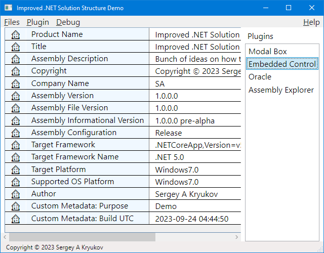

@numbering {
    enable: false
}

{title}Improving .NET Solition Structure: WPF

[*Sergey A Kryukov*](https://www.SAKryukov.org)

How to find out whether the Earth is flat or not? Just use the presented application and a digital camera.

The Earth's flatness (curvature) measurements are performed using a digital camera based on statistical processing of the big set of photographed features, taking into account atmospheric refraction, lens distortion, geolocation, and accelerometer data. The result is calculated automatically. The image recognition methods can use the patterns of the surface ocean waves, sand dunes, clouds, and the color gradients of the clear blue sky.

<!-- <h2>Contents</h2> is not Markdown element, just to avoid adding it to TOC -->
<!-- change style in next line <ul> to <ul style="list-style-type: none"> -->
<!--
For CodeProject, makes sure there are no HTML comments in the area to past!


--> 
---
<!-- copy to CodeProject from here 
αβγδΔπ
------------------------------------------->


## Contents{no-toc}


<blockquote id="epigraph" class="FQ"><div class="FQA">Epigraph:</div>
<dt><i>Everything should be made as simple as possible, but no simpler</i></dt>
<dd>Albert Einstein</dd>
</blockquote>

@toc

## Introduction

This is the second article of the projected diptych of two article on the .NET solution structure:

1. *[Improving .NET Solition Structure: Code Isolation](https://www.codeproject.com/???)*
2. *Present article*

The first article discusses the most common problems and suggested solutions, and the second one discusses the WPF-related topics.

Both article and the current snapshot of the code can be found in my [GitHub repository](https://github.com/SAKryukov/dotnet-solution-structure).

## Extended Application

### Explicit Main
### Exposing Assembly Attributes 
### Exposing Custom Assembly Attributes
### Exception Handling

### Centralized and Cascading Styling and Resource Dictionaries

## Plugin Architecture
### Non-Visual Plugins
### UI Plugins

### Accessing ResourceDictionary

[Microsof documentation suggested way](https://learn.microsoft.com/en-us/dotnet/desktop/wpf/systems/xaml-resources-and-code?view=netdesktop-7.0#accessing-resources-from-code) is this:

```{lang=C#}{id=code-resource-lookup}
Button b = sender as Button;
b.Background = (Brush)this.FindResource("RainbowBrush");
```
What if you need to get a resource dictionary value from a XAML file?

Here is what [one stackoverflow answer](https://stackoverflow.com/a/3553781) recommends:

```{lang=C#}{id=code-find-resource-dictionary}
var resource = new ResourceDictionary
{
    Source = new Uri("/myAssemblyName;component/Themes/generic.xaml",
                     UriKind.RelativeOrAbsolute)
};```

Needless to say, both techniques demonstrate the well-known [magic string](https://en.wikipedia.org/wiki/Magic_string) anti-pattern. Not only in the above code samples an innocent typo won't be detected by the build process, but the code will be broken if the developer moves some files around.

Fortubately, for the first problem I have a simple workaround...


## Conclusions
<p></p>

<!-- copy to CodeProject to here --------------------------------------------->
